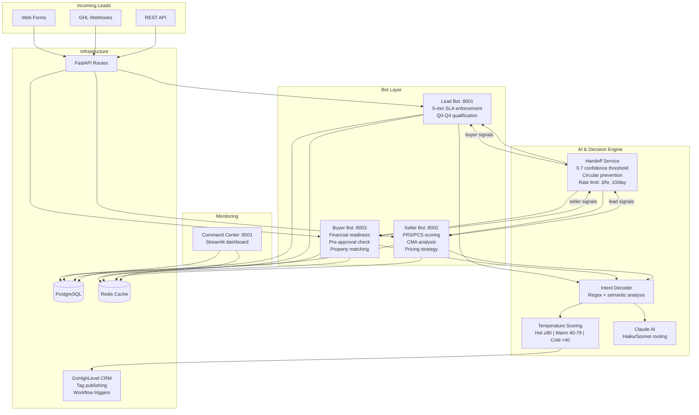

[](https://github.com/sponsors/ChunkyTortoise)

# Jorge Real Estate Bots

**40% of real estate leads go cold because agents take >5 minutes to respond.** Three specialized bots handle lead qualification, buyer matching, and seller CMAs in real time.

[](https://github.com/ChunkyTortoise/jorge_real_estate_bots/actions)
[](https://www.python.org/)
[](tests/)
[](LICENSE)

## What This Solves

- **Missed leads** -- Bots respond within seconds, not minutes. The Lead Bot enforces the 5-minute SLA and auto-qualifies prospects while human agents are busy
- **Manual qualification is slow** -- Structured Q0-Q4 question flows extract budget, timeline, pre-approval status, and motivation without agent involvement
- **No pipeline visibility** -- A Streamlit command center shows lead flow, bot performance, conversation health, and commission tracking across all three bots

## Key Metrics

| Metric | Value |
|--------|-------|
| Tests | **350+ passing** |
| Bots | 3 specialized (Lead, Buyer, Seller) |
| Cross-Bot Handoff | 0.7 confidence threshold, circular prevention, rate limiting |
| CRM Integration | GoHighLevel real-time sync |
| Temperature Scoring | Hot/Warm/Cold with automated tag publishing |
| AI Routing | Claude Haiku/Sonnet model selection |
| Docker | Full compose stack (Postgres, Redis, 3 bots, dashboard) |

## Architecture



## Quick Start

```bash
git clone https://github.com/ChunkyTortoise/jorge_real_estate_bots.git
cd jorge_real_estate_bots
pip install -r requirements.txt

# Demo mode — no API keys needed, pre-seeded sample leads
python jorge_launcher.py --demo
```

### Full Setup (with external services)

```bash
cp .env.example .env
# Edit .env with your API keys

# Launch all services
python jorge_launcher.py

# Or launch individually
uvicorn bots.lead_bot.main:app --port 8001
uvicorn bots.seller_bot.main:app --port 8002
uvicorn bots.buyer_bot.main:app --port 8003
streamlit run command_center/dashboard_v3.py
```

## Bot Capabilities

**Lead Bot** -- Semantic lead analysis powered by Claude AI. Enforces the 5-minute response rule. Scores leads 0-100 with hot/warm/cold classification, triggers automated nurture sequences, and updates GoHighLevel CRM in real time.

**Seller Bot** -- Confrontational qualification engine using a structured Q1-Q4 question flow. Generates comparative market analyses, provides pricing strategy recommendations, and handles seller objections with configurable escalation paths.

**Buyer Bot** -- Full qualification flow (Q0-Q4), preference extraction, temperature scoring, and weighted property matching against Postgres listings. Writes buyer preferences and conversation history to the database and triggers GHL workflows when qualified.

## Tech Stack

| Layer | Technology |
|-------|------------|
| API | FastAPI, Pydantic, uvicorn |
| Dashboard | Streamlit, Plotly |
| AI | Claude (Haiku/Sonnet routing) |
| Database | PostgreSQL, SQLAlchemy (async), Alembic |
| Cache | Redis with in-memory fallback |
| CRM | GoHighLevel (webhooks, custom fields, workflows) |
| Testing | pytest, pytest-asyncio (350+ tests) |

## Project Structure

```
jorge_real_estate_bots/
├── bots/
│   ├── shared/           # Config, Claude client, GHL client, cache, auth
│   ├── lead_bot/         # Semantic analysis, 5-min rule, webhook handlers
│   ├── seller_bot/       # Q1-Q4 qualification, CMA engine
│   └── buyer_bot/        # Buyer qualification + property matching
├── database/             # SQLAlchemy models, async session, repository
├── command_center/       # Streamlit dashboard + monitoring components
├── benchmarks/           # Performance benchmarks (bot response, handoff)
├── tests/                # 350+ tests
├── jorge_launcher.py     # Single-command startup for all services
└── docker-compose.yml
```

## Architecture Decisions

| ADR | Title | Status |
|-----|-------|--------|
| [ADR-0001](docs/adr/0001-three-bot-separation.md) | Three Separate Bots Instead of One Unified Bot | Accepted |
| [ADR-0002](docs/adr/0002-confidence-threshold-handoff.md) | 0.7 Confidence Threshold for Cross-Bot Handoff | Accepted |
| [ADR-0003](docs/adr/0003-temperature-tag-publishing.md) | Lead Temperature Scoring and GHL Tag Automation | Accepted |

## Benchmarks

See [BENCHMARKS.md](BENCHMARKS.md) for performance methodology and results. Run locally:

```bash
python benchmarks/run_all.py
```

## Testing

```bash
pytest tests/ -v                    # Full suite (350+ tests)
pytest tests/shared/ -v             # Shared services
pytest tests/seller_bot/ -v         # Seller qualification
pytest tests/buyer_bot/ -v          # Buyer qualification
pytest tests/command_center/ -v     # Dashboard components
```

## Changelog

See [CHANGELOG.md](CHANGELOG.md) for release history.

## Related Projects

- [EnterpriseHub](https://github.com/ChunkyTortoise/EnterpriseHub) -- Full real estate AI platform this was extracted from, with BI dashboards and CRM integration
- [ai-orchestrator](https://github.com/ChunkyTortoise/ai-orchestrator) -- AgentForge: unified async LLM interface (Claude, Gemini, OpenAI, Perplexity)
- [Revenue-Sprint](https://github.com/ChunkyTortoise/Revenue-Sprint) -- AI-powered freelance pipeline: job scanning, proposal generation, prompt injection testing
- [insight-engine](https://github.com/ChunkyTortoise/insight-engine) -- Upload CSV/Excel, get instant dashboards, predictive models, and reports
- [docqa-engine](https://github.com/ChunkyTortoise/docqa-engine) -- RAG document Q&A with hybrid retrieval and prompt engineering lab
- [scrape-and-serve](https://github.com/ChunkyTortoise/scrape-and-serve) -- Web scraping, price monitoring, Excel-to-web apps, and SEO tools
- [Portfolio](https://chunkytortoise.github.io) -- Project showcase and services

## License

MIT
