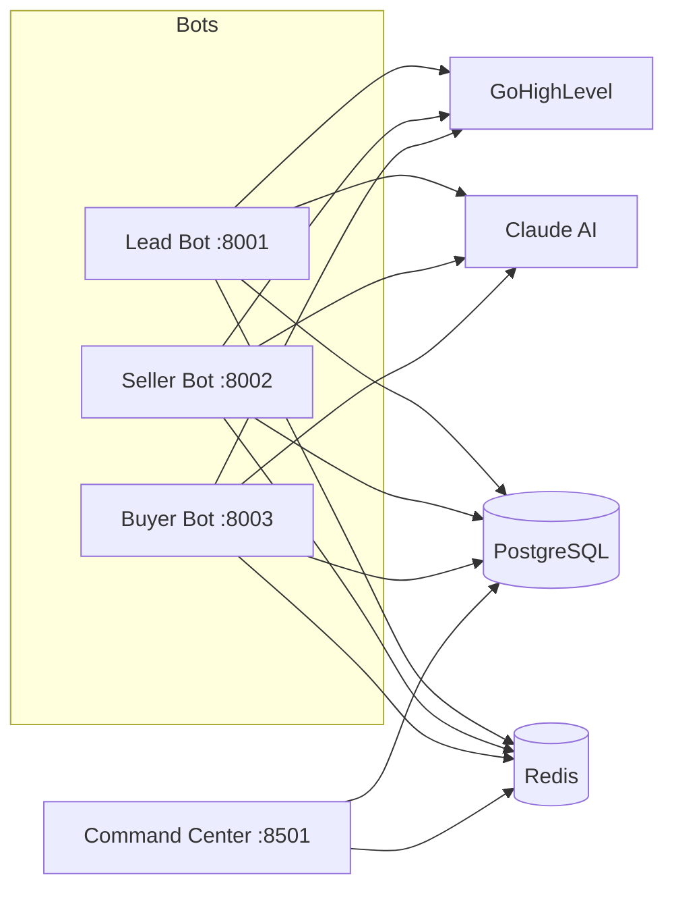

# Jorge Real Estate AI

**Single-Agent MVP -- Production Patterns from Enterprise Platform**


## The Story

This project distills 9,400 lines of focused, production-grade code from a 618,000-line enterprise real estate platform ([EnterpriseHub](https://github.com/cave/EnterpriseHub)), retaining battle-tested patterns while removing 98.5% of the complexity. Built in a single intensive 17-hour session, it demonstrates code extraction and refinement expertise: knowing what to keep, what to cut, and how to ship a working system with 279 tests and a 90%+ coverage target.

> Extraction callout: 618K lines → 9.4K lines (98.5% reduction) while preserving production-grade patterns.

## Architecture



## Screenshots


## Key Metrics

| Metric | Measured | Target | Status |
|--------|----------|--------|--------|
| Lead analysis latency | 489ms | < 500ms | Pass |
| Cache hit latency | 0.19ms | < 100ms | Pass |
| Pattern scoring latency | 0.08ms | < 100ms | 1,250x faster |
| Test suite execution | 279 tests | -- | Updated |
| Test coverage | 90%+ target | 80% | Target |

## Bot Capabilities

**Lead Bot** -- Semantic lead analysis powered by Claude AI. Enforces the 5-minute response rule (leads contacted within 5 minutes convert at 10x the rate). Scores leads 0-100 with hot/warm/cold classification, triggers automated nurture sequences, and updates GoHighLevel CRM fields in real time.

**Seller Bot** -- Confrontational qualification engine using a structured Q1-Q4 question flow. Generates comparative market analyses, provides pricing strategy recommendations, and handles seller objections with configurable escalation paths.

**Buyer Bot** -- Full qualification flow (Q0-Q4), preference extraction, temperature scoring, and weighted property matching against Postgres listings. Writes buyer preferences and conversation history to the database and triggers GHL tags/opportunities/workflows when qualified.

## Buyer Bot Flow

Q0 greet → Q1 preferences → Q2 pre-approval → Q3 timeline → Q4 motivation → qualified.  
Temperature logic: HOT = pre-approved + ≤30 days, WARM = ≤90 days, COLD = browsing/unknown.  
Matching: weighted on beds, baths, sqft, price range, and location against `properties`.

## Tech Stack

| Layer | Technology |
|-------|------------|
| API | FastAPI, Pydantic, uvicorn |
| Dashboard | Streamlit, Plotly |
| AI | Claude (Haiku/Sonnet/Opus routing) |
| Database | PostgreSQL, SQLAlchemy, Alembic |
| Cache | Redis with in-memory fallback |
| CRM | GoHighLevel (webhooks, custom fields) |
| Testing | pytest, pytest-asyncio, pytest-cov |

## Quick Start

```bash
# Clone
git clone https://github.com/cave/jorge_real_estate_bots.git
cd jorge_real_estate_bots

# Environment
python -m venv venv
source venv/bin/activate
pip install -r requirements.txt

# Configuration
cp .env.example .env
# Edit .env with your API keys (see comments in .env.example)

# Launch all services
python jorge_launcher.py

# Or launch individually
uvicorn bots.lead_bot.main:app --port 8001 --reload
uvicorn bots.seller_bot.main:app --port 8002 --reload
streamlit run command_center/dashboard_v3.py
```

**Config highlights**
- Set `DATABASE_URL` for Postgres + Alembic migrations.
- Set `GHL_WEBHOOK_PUBLIC_KEY` (or `GHL_WEBHOOK_SECRET` for legacy HMAC) for webhook verification.
- Set `BUYER_PIPELINE_ID` and `BUYER_ALERT_WORKFLOW_ID` to enable buyer-side automations.

## Docker Quick Start

```bash
# Build + run all services (FastAPI bots, dashboard, Postgres, Redis)
docker compose up --build

# Run migrations (in a separate terminal)
docker compose exec lead-bot alembic upgrade head
```

Open the dashboard at `http://localhost:8501`.

## Testing

```bash
# Full suite
pytest tests/ -v

# With coverage
pytest tests/ --cov=bots --cov=command_center --cov-report=term-missing

# Individual bot tests
pytest tests/shared/ -v
pytest tests/seller_bot/ -v
pytest tests/command_center/ -v
```

279 tests across shared services, seller and buyer bot qualification flows, and the command center UI components. Coverage target: 90%+. All tests run locally with no external dependencies required.

## Project Structure

```
jorge_real_estate_bots/
├── alembic/              # Database migrations
├── bots/
│   ├── shared/           # Config, Claude client, GHL client, cache, logging
│   ├── lead_bot/         # Semantic analysis, 5-min rule, webhook handlers
│   ├── seller_bot/       # Q1-Q4 qualification, CMA engine
│   └── buyer_bot/        # Buyer qualification + property matching
├── database/             # SQLAlchemy models + async session
├── command_center/       # Streamlit dashboard, components, monitoring
├── ghl_integration/      # GoHighLevel webhook configuration
├── tests/                # 231 tests, 92% coverage
├── docs/                 # Phase reports, reference docs, handoffs
├── scripts/              # Utility and integration test scripts
├── examples/             # Integration usage examples
├── jorge_launcher.py     # Single-command startup for all services
├── requirements.txt      # Python dependencies
└── .env.example          # Environment variable template
```

## Relationship to EnterpriseHub

This repository is a focused extraction from [EnterpriseHub](https://github.com/cave/EnterpriseHub), a 618K-line enterprise real estate AI and BI platform. The extraction process involved identifying the core value-delivering components, removing multi-tenant scaffolding, simplifying the orchestration layer, and re-validating every code path with targeted tests. The result is a standalone MVP that preserves production-grade error handling, caching, and observability patterns at a fraction of the footprint.

## License

MIT
