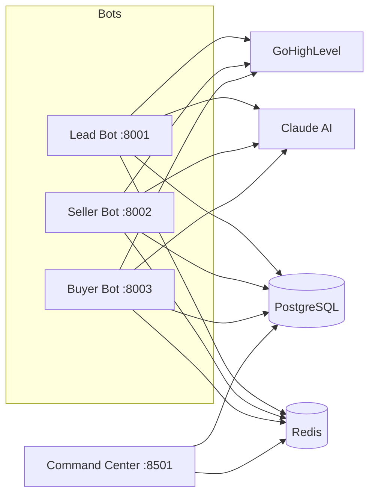

# Jorge Real Estate Bots

**3-Bot AI Qualification System for Real Estate Lead Management**


## What This Is

Three FastAPI microservices that qualify real estate leads through a structured Q0-Q4 question framework, powered by Claude AI. Each bot runs independently with its own port, shares a PostgreSQL database, and syncs results to GoHighLevel CRM. A Streamlit command center provides real-time monitoring across all bots.

Built for a real estate client in the Rancho Cucamonga market.

## Architecture



## Bot Capabilities

**Lead Bot** -- Semantic lead analysis powered by Claude AI. Enforces the 5-minute response rule. Scores leads 0-100 with hot/warm/cold classification, triggers automated nurture sequences, and updates GoHighLevel CRM fields in real time.

**Seller Bot** -- Confrontational qualification engine using a structured Q1-Q4 question flow. Generates comparative market analyses, provides pricing strategy recommendations, and handles seller objections with configurable escalation paths.

**Buyer Bot** -- Full qualification flow (Q0-Q4), preference extraction, temperature scoring, and weighted property matching against Postgres listings. Writes buyer preferences and conversation history to the database and triggers GHL workflows when qualified.

### Buyer Qualification Flow

Q0 greet -> Q1 preferences -> Q2 pre-approval -> Q3 timeline -> Q4 motivation -> qualified.
Temperature: HOT = pre-approved + <=30 days, WARM = <=90 days, COLD = browsing/unknown.
Matching: weighted on beds, baths, sqft, price range, and location.

## Tech Stack

| Layer | Technology |
|-------|------------|
| API | FastAPI, Pydantic, uvicorn |
| Dashboard | Streamlit, Plotly |
| AI | Claude (Haiku/Sonnet routing) |
| Database | PostgreSQL, SQLAlchemy (async), Alembic |
| Cache | Redis with in-memory fallback |
| CRM | GoHighLevel (webhooks, custom fields, workflows) |
| Testing | pytest, pytest-asyncio, pytest-cov |

## Quick Start

```bash
git clone https://github.com/ChunkyTortoise/jorge_real_estate_bots.git
cd jorge_real_estate_bots

python -m venv venv
source venv/bin/activate
pip install -r requirements.txt

cp .env.example .env
# Edit .env with your API keys

# Launch all services
python jorge_launcher.py

# Or launch individually
uvicorn bots.lead_bot.main:app --port 8001
uvicorn bots.seller_bot.main:app --port 8002
uvicorn bots.buyer_bot.main:app --port 8003
streamlit run command_center/dashboard_v3.py
```

### Docker

```bash
docker compose up --build

# Run migrations (separate terminal)
docker compose exec lead-bot alembic upgrade head
```

Dashboard at `http://localhost:8501`.

### Required Environment Variables

```
ANTHROPIC_API_KEY=sk-ant-...       # Claude AI
DATABASE_URL=postgresql://...       # PostgreSQL
REDIS_URL=redis://localhost:6379    # Redis
GHL_API_KEY=...                     # GoHighLevel CRM
GHL_LOCATION_ID=...                 # GHL location
JWT_SECRET=...                      # Auth token signing
```

## Testing

```bash
# Full suite
pytest tests/ -v

# With coverage
pytest tests/ --cov=bots --cov=command_center --cov-report=term-missing

# Individual bot tests
pytest tests/shared/ -v
pytest tests/seller_bot/ -v
pytest tests/buyer_bot/ -v
pytest tests/command_center/ -v
```

279 tests passing across shared services, seller/buyer qualification flows, and command center components. All tests run locally with no external dependencies.

## Project Structure

```
jorge_real_estate_bots/
├── bots/
│   ├── shared/           # Config, Claude client, GHL client, cache, auth, logging
│   ├── lead_bot/         # Semantic analysis, 5-min rule, webhook handlers
│   ├── seller_bot/       # Q1-Q4 qualification, CMA engine
│   └── buyer_bot/        # Buyer qualification + property matching
├── database/             # SQLAlchemy models, async session, repository
├── command_center/       # Streamlit dashboard + monitoring components
├── ghl_integration/      # GoHighLevel webhook configuration
├── tests/                # 279 tests
├── alembic/              # Database migrations
├── jorge_launcher.py     # Single-command startup for all services
├── requirements.txt
├── docker-compose.yml
└── .env.example
```

## Technical Spec

See [docs/SPEC.md](docs/SPEC.md) for the full technical specification including module map, database schema, API endpoints, and known issues.

## Related Projects

- [**EnterpriseHub**](https://github.com/ChunkyTortoise/EnterpriseHub) -- Full real estate AI platform this was extracted from. Multi-LLM orchestration, BI dashboards, agent mesh coordination.

## License

MIT
