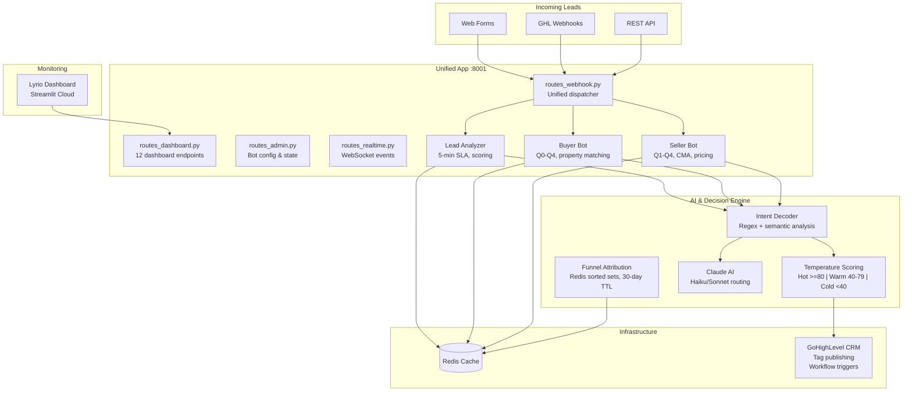

[](https://github.com/sponsors/ChunkyTortoise)

# Jorge Real Estate Bots

**40% of real estate leads go cold because agents take >5 minutes to respond.** Three specialized bots handle lead qualification, buyer matching, and seller CMAs in real time.

[](https://github.com/ChunkyTortoise/jorge_real_estate_bots/actions)
[](https://www.python.org/)
[](tests/)
[](LICENSE)

## What This Solves

- **Missed leads** -- Bots respond within seconds, not minutes. The Lead Bot enforces the 5-minute SLA and auto-qualifies prospects while human agents are busy
- **Manual qualification is slow** -- Structured Q0-Q4 question flows extract budget, timeline, pre-approval status, and motivation without agent involvement
- **No pipeline visibility** -- A Streamlit command center shows lead flow, bot performance, conversation health, and commission tracking across all three bots

## Key Metrics

| Metric | Value |
|--------|-------|
| Tests | **1330+ passing** |
| Bots | 3 specialized (Lead, Buyer, Seller) |
| Cross-Bot Handoff | 0.7 confidence threshold, circular prevention, rate limiting |
| CRM Integration | GoHighLevel real-time sync |
| Temperature Scoring | Hot/Warm/Cold with automated tag publishing |
| AI Routing | Claude Haiku/Sonnet model selection |
| Deploy | Render (single unified app) + Docker Compose |

## Architecture

All three bots run as a single FastAPI application using the APIRouter pattern. Incoming webhooks are routed to the correct bot via the unified dispatcher.


```mermaid
flowchart TB
  subgraph Incoming["Incoming Leads"]
    Web["Web Forms"]
    GHLHook["GHL Webhooks"]
    API["REST API"]
  end

  subgraph App["Unified App :8001"]
    Webhook["routes_webhook.py\nUnified dispatcher"]
    Dashboard["routes_dashboard.py\n12 dashboard endpoints"]
    Admin["routes_admin.py\nBot config & state"]
    Realtime["routes_realtime.py\nWebSocket events"]
    Lead["Lead Analyzer\n5-min SLA, scoring"]
    Buyer["Buyer Bot\nQ0-Q4, property matching"]
    Seller["Seller Bot\nQ1-Q4, CMA, pricing"]
  end

  subgraph Intelligence["AI & Decision Engine"]
    Intent["Intent Decoder\nRegex + semantic analysis"]
    Temp["Temperature Scoring\nHot >=80 | Warm 40-79 | Cold <40"]
    Claude["Claude AI\nHaiku/Sonnet routing"]
    Funnel["Funnel Attribution\nRedis sorted sets, 30-day TTL"]
  end

  subgraph Infra["Infrastructure"]
    Redis[(Redis Cache)]
    GHL["GoHighLevel CRM\nTag publishing\nWorkflow triggers"]
  end

  subgraph Dashboard_UI["Monitoring"]
    Lyrio["Lyrio Dashboard\nStreamlit Cloud"]
  end

  Web --> Webhook
  GHLHook --> Webhook
  API --> Webhook

  Webhook --> Lead
  Webhook --> Buyer
  Webhook --> Seller

  Lead --> Intent
  Buyer --> Intent
  Seller --> Intent

  Intent --> Temp
  Intent --> Claude

  Lead --> Redis
  Buyer --> Redis
  Seller --> Redis
  Funnel --> Redis

  Temp --> GHL
  Lyrio --> Dashboard
```

## Quick Start

```bash
git clone https://github.com/ChunkyTortoise/jorge_real_estate_bots.git
cd jorge_real_estate_bots
pip install -r requirements.txt

# Start the unified app
uvicorn bots.lead_bot.main:app --host 0.0.0.0 --port 8001
```

### Docker

```bash
cp .env.example .env
# Edit .env with your API keys

docker compose up
# App on :8001, Dashboard on :8501
```

### Render Deployment

The repo includes `render.yaml` for Render Blueprint deployment. Connect the repo and configure the `jorge-env` environment group with:
`REDIS_URL`, `GHL_API_KEY`, `ADMIN_API_KEY`, `ANTHROPIC_API_KEY`, `GHL_LOCATION_ID`, `JORGE_USER_ID`, `JORGE_CALENDAR_ID`

## Bot Capabilities

**Lead Bot** -- Semantic lead analysis powered by Claude AI. Enforces the 5-minute response rule. Scores leads 0-100 with hot/warm/cold classification, triggers automated nurture sequences, and updates GoHighLevel CRM in real time.

**Seller Bot** -- Confrontational qualification engine using a structured Q1-Q4 question flow. Generates comparative market analyses, provides pricing strategy recommendations, and handles seller objections with configurable escalation paths.

**Buyer Bot** -- Full qualification flow (Q0-Q4), preference extraction, temperature scoring, and weighted property matching. Writes buyer preferences and conversation history to Redis and triggers GHL workflows when qualified.

## Tech Stack

| Layer | Technology |
|-------|------------|
| API | FastAPI (APIRouter pattern), Pydantic, uvicorn |
| Dashboard | Streamlit (Lyrio), Plotly |
| AI | Claude (Haiku/Sonnet routing) |
| Cache | Redis (sorted sets, rate limiting, bot state, funnel attribution) |
| CRM | GoHighLevel (webhooks, custom fields, workflows) |
| Testing | pytest, pytest-asyncio (1330+ tests) |

## Project Structure

```
jorge_real_estate_bots/
├── bots/
│   ├── shared/              # Config, Claude client, GHL client, cache, auth,
│   │                        # funnel_attribution, stall_reengagement,
│   │                        # bot_metrics_collector, alerting_service,
│   │                        # sms_metrics_collector, response_filter
│   ├── lead_bot/
│   │   ├── main.py          # FastAPI app, includes all routers
│   │   ├── routes_webhook.py     # GHL webhook dispatcher (unified + new-lead)
│   │   ├── routes_dashboard.py   # 12 dashboard/alert endpoints
│   │   ├── routes_admin.py       # Bot settings, reassign, reset state
│   │   ├── routes_realtime.py    # WebSocket events, recent events
│   │   ├── routes_productization.py  # Playbooks, reports
│   │   └── routes_test_endpoints.py  # Hardening test endpoints
│   ├── seller_bot/          # Q1-Q4 qualification, CMA engine
│   └── buyer_bot/           # Buyer qualification + property matching
├── database/                # SQLAlchemy models, async session
├── command_center/          # Streamlit dashboard components
├── tests/                   # 1330+ tests
├── docker-compose.yml       # Redis + app + dashboard
├── render.yaml              # Render Blueprint config
└── Dockerfile
```

## API Endpoints

All endpoints are served from a single app on port 8001.

### Webhooks (`routes_webhook.py`)
- `POST /ghl/webhook/new-lead` -- New lead webhook from GHL
- `POST /api/ghl/webhook` -- Unified dispatcher (routes to Lead/Buyer/Seller by bot_type)
- `POST /api/ghl/webhook/message-status` -- SMS delivery status callbacks

### Dashboard (`routes_dashboard.py`)
- `GET /api/dashboard/metrics` -- System + performance metrics
- `GET /api/dashboard/leads/summary` -- Hero metrics + conversation summary
- `GET /api/dashboard/leads` -- Paginated lead list (filterable by temperature)
- `GET /api/dashboard/leads/{contact_id}` -- Single lead detail
- `GET /api/dashboard/handoffs` -- Recent handoff events (with contact_id)
- `GET /api/dashboard/conversations/{contact_id}` -- Q&A transcript
- `GET /api/dashboard/costs` -- Cost/ROI data, commission pipeline
- `GET /api/dashboard/sms-metrics` -- SMS delivery stats (7-day rolling)
- `GET /api/dashboard/funnel` -- Funnel conversion by stage (AWARENESS through CONVERSION)
- `GET /api/dashboard/stall-stats` -- Stall re-engagement stats (optional ?contact_id filter)
- `GET /api/alerts/active` -- Active alerts
- `POST /api/alerts/{alert_id}/acknowledge` -- Acknowledge an alert

### Admin (`routes_admin.py`)
- `GET /admin/settings` -- Current bot settings
- `POST /admin/reassign-bot` -- Reassign contact to different bot
- `PUT /admin/settings/{bot}` -- Update bot configuration
- `DELETE /admin/reset-state/{bot}/{contact_id}` -- Reset conversation state

### Real-time (`routes_realtime.py`)
- `GET /api/events/recent` -- Recent events (filterable, since_minutes, event_types)
- `GET /api/events/ws-status` -- WebSocket connection health
- `GET /api/events/health` -- Event system health (Redis check)
- `WS /ws/events` -- Live event stream

### curl Examples

**Analyze a new lead:**
```bash
curl -X POST http://localhost:8001/analyze-lead \
  -H "Content-Type: application/json" \
  -d '{
    "contact_id": "abc123",
    "name": "Maria Santos",
    "email": "maria@example.com",
    "phone": "+1-555-0142",
    "message": "Looking to buy a 3BR home in Coral Gables under $650k. Pre-approved with Chase.",
    "source": "website"
  }'
```

**Get funnel conversion data:**
```bash
curl http://localhost:8001/api/dashboard/funnel \
  -H "X-Admin-Key: YOUR_ADMIN_KEY"
```

**Get stall stats:**
```bash
curl http://localhost:8001/api/dashboard/stall-stats \
  -H "X-Admin-Key: YOUR_ADMIN_KEY"
```

## Troubleshooting

See [docs/TROUBLESHOOTING.md](docs/TROUBLESHOOTING.md) for solutions to common issues: GHL webhook setup, Redis connection errors, environment variable checklist, HTTP error codes, and bot handoff failures.

## Testing

```bash
pytest tests/ -v                    # Full suite (1330+ tests)
pytest tests/shared/ -v             # Shared services
pytest tests/api/ -v                # Dashboard & API routes
pytest tests/lead_bot/ -v           # Realtime events
```

## Changelog

See [CHANGELOG.md](CHANGELOG.md) for release history.

## Related Projects

- [EnterpriseHub](https://github.com/ChunkyTortoise/EnterpriseHub) -- Full real estate AI platform this was extracted from, with BI dashboards and CRM integration
- [Lyrio Dashboard](https://github.com/ChunkyTortoise/lyrio-dashboard) -- Streamlit analytics dashboard with AI concierge, connected to Jorge API
- [ai-orchestrator](https://github.com/ChunkyTortoise/ai-orchestrator) -- AgentForge: unified async LLM interface (Claude, Gemini, OpenAI, Perplexity)

## License

MIT
