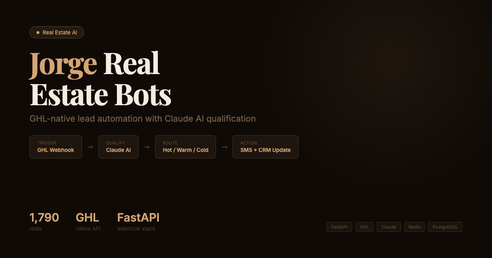
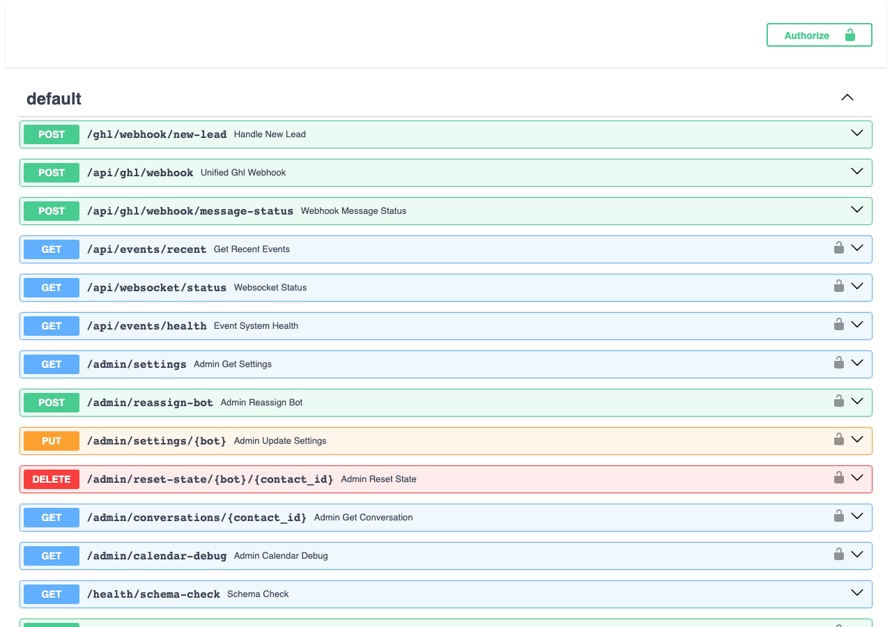
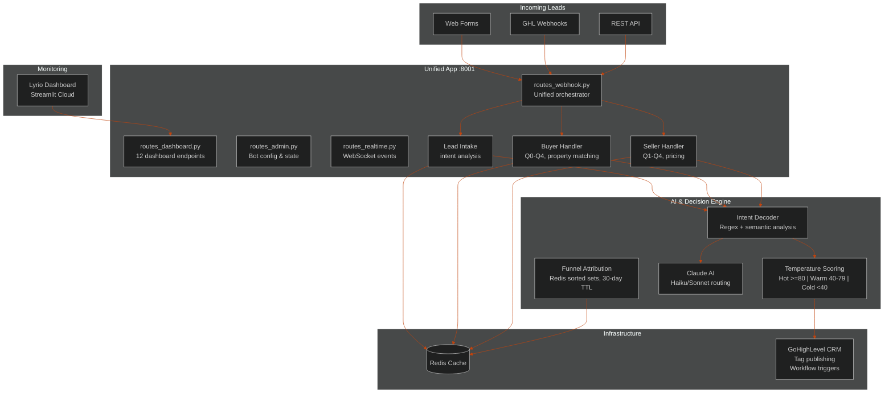

# Jorge Real Estate Bots

Jorge uses one unified conversation system with specialized seller, buyer, and lead-intake handlers behind a single routing layer.

[](#render-deployment)
[](https://github.com/ChunkyTortoise/jorge_real_estate_bots/actions)
[](https://www.python.org/)
[](https://fastapi.tiangolo.com)
[](https://redis.io)
[](https://anthropic.com)
[](LICENSE)

> **Client system** - Automated lead qualification for a real estate agency using GHL webhooks, Claude AI, and Redis.

> Built for Acuity Real Estate in a paid contract engagement. The client reported 500+ inbound leads processed through GoHighLevel CRM during the January to March 2026 deployment. The handoff included 1,700+ tests and an audit of 226 existing GoHighLevel workflows.

### Production Dashboard (Lyrio)

The production dashboard is not included in this public repository. The API endpoints and the dashboard integration points are documented below.

## What This Solves

- **Missed leads** -- The app responds within seconds, not minutes, and routes each contact into the correct qualification path
- **Manual qualification is slow** -- Structured seller and buyer flows extract budget, timeline, pre-approval status, motivation, condition, and price without agent involvement
- **No pipeline visibility** -- Admin and dashboard APIs expose canonical mode, status, handoff reason, and next-step state for every conversation

## Key Metrics

| Metric | Value |
|--------|-------|
| Tests at handoff | **1,700+** |
| Public model | 1 canonical conversation system |
| Cross-Bot Handoff | 0.7 confidence threshold, circular prevention, rate limiting |
| CRM Integration | GoHighLevel real-time sync |
| Temperature Scoring | Hot/Warm/Cold with automated tag publishing |
| AI Routing | Claude Haiku/Sonnet model selection |
| Deploy | Render (single unified app) + Docker Compose |

## Business Impact

| Metric | Value |
|--------|-------|
| Inbound leads processed | Client-reported 500+ during January to March 2026 |
| Languages | English and Spanish (no additional staffing) |

## Scope and Contribution

What I built, and what was already running before I arrived. A reviewer should not have to guess where the client's platform ends and my engineering begins.

**Mine.** Every line of application code in this repository. 188 commits, sole author, from the initial commit on 2026-01-23 through handoff. 178 of those fall inside the January to March 2026 engagement window, 112 of them feature, fix, refactor, or test commits. The test suite is mine as well: 1,729 test functions across 96 files.

```bash
git log --format='%an' | sort -u                    # one author
git log --format='%ci' | cut -c1-7 | sort | uniq -c # commits by month
rg -c '^\s*(async )?def test_' tests/              # test functions per file
```

**Not mine.** GoHighLevel is the client's CRM platform. I built the integration layer against it (webhook normalization, deduplication, per-contact locking, real-time sync), not the platform. The 226 GoHighLevel workflows referenced below were **pre-existing client configuration**; that work was an inventory and findings audit over what was already running, not workflows I authored. The production dashboard (Lyrio) is the client's and is not in this repository.

**Client-reported, not independently audited.** The 500+ inbound lead figure comes from the client's GoHighLevel contact records for the January to March 2026 run. I did not re-count it from a raw export, and it should be read as client reporting rather than a third-party audited number.

## Deployment and Implementation Evidence

Documented evidence from the January to March 2026 deployment and repository implementation:

| System | Metric | Value | How Verified |
|--------|--------|-------|-------------|
| **Lead Processing** | Total inbound leads processed | Client-reported 500+ | Client reporting for the January to March 2026 deployment |
| **Webhook Reliability** | Deduplication | Two-phase TTL (120s guard + 300s post-success) | `routes_webhook.py` dedup keys |
| **Webhook Reliability** | Per-contact lock | Atomic `setnx`, 90s TTL | Prevents concurrent message handling |
| **Rate Limiting** | Global | Per-minute + per-endpoint | `rate_limit_middleware.py` |
| **Rate Limiting** | Per-contact | 10 msgs/min | Redis counter with TTL |
| **Model Routing** | Haiku | Routine tasks (lead categorization) | `claude_client.py` TaskComplexity enum |
| **Model Routing** | Sonnet | Complex analysis (qualification) | Cost/quality-aware routing |
| **Model Routing** | Opus | High-stakes (seller negotiations) | Reserved for critical decisions |
| **Prompt Caching** | Anthropic cache | Enabled for >1024 char system prompts | `cache_read_input_tokens` tracking |
| **Circuit Breaker** | GHL API protection | Opens after 5 failures in 60s, 30s cooldown | `GHLCircuitBreaker` class |
| **Conversation History** | Context window | 20 messages (10 turns) max | Prevents context bloat |
| **Response Safety** | Identity filters | 38 regex patterns | `response_filter.py` |
| **Response Safety** | Output truncation | 480 chars at word boundary | SMS-compatible responses |
| **Bilingual** | Spanish detection | 2+ indicator words from frozen set | Auto-routes to BILINGUAL_HANDOFF |
| **Test Suite** | Tests at handoff | 1,700+ | Handoff repository state |
| **Retry Logic** | Anthropic API | Exponential backoff (2s-15s) via tenacity | RateLimitError + InternalServerError |

## For Hiring Managers

| If you're evaluating for... | Where to look | Production Evidence & Design |
|-----------------------------|--------------|------------------------------|
| **AI / ML Engineer** | Claude conversation engine ([`bots/shared/claude_client.py`](bots/shared/claude_client.py)), confidence-based model routing ([`bots/shared/business_rules.py`](bots/shared/business_rules.py)), multi-turn memory management | Two-pass Claude routing (Haiku/Sonnet/Opus), prompt caching (>1024 chars), 38-pattern regex response safety filter |
| **Backend / AI Automation Engineer** | Webhook normalization + dedup + per-contact locking ([`bots/lead_bot/routes_webhook.py`](bots/lead_bot/routes_webhook.py)), Redis rate limiting, GHL CRM real-time sync | Two-phase TTL dedup (120s guard + 300s post-success), atomic `setnx` per-contact lock, 1,729-function test suite |
| **CRM / Marketing Automation** | Full AWARENESS→CONVERSION funnel attribution ([`bots/shared/funnel_attribution.py`](bots/shared/funnel_attribution.py)), SMS re-engagement sequences ([`bots/shared/stall_reengagement.py`](bots/shared/stall_reengagement.py)), campaign metrics ([`bots/shared/sms_metrics_collector.py`](bots/shared/sms_metrics_collector.py)) | GHL webhook deduplication, automated Hot/Warm/Cold tag publishing, bilingual EN/ES auto-routing |
| **Data Analyst / BI** | Lead dashboard API ([`bots/lead_bot/routes_dashboard.py`](bots/lead_bot/routes_dashboard.py)), funnel conversion metrics, per-stage ROI tracking | 12 dashboard endpoints, stage-by-stage conversion analytics, Redis sorted sets with 30-day rolling TTL |

## API Overview

**30+ endpoints** across webhook routing, lead dashboard, admin controls, and real-time events:



## Architecture

The system runs as a single FastAPI application. Incoming webhooks are normalized, deduplicated, locked per-contact, resolved to a canonical mode, and then dispatched to specialized internal handlers.


```mermaid
%%{init: {'theme': 'dark', 'themeVariables': {'primaryColor': '#D4A574', 'primaryBorderColor': '#C1440E', 'primaryTextColor': '#E2E8F0', 'lineColor': '#C1440E', 'background': '#1A1510'}}}%%
flowchart TB
  subgraph Incoming["Incoming Leads"]
    Web["Web Forms"]
    GHLHook["GHL Webhooks"]
    API["REST API"]
  end

  subgraph App["Unified App :8001"]
    Webhook["routes_webhook.py\nUnified orchestrator"]
    Dashboard["routes_dashboard.py\n12 dashboard endpoints"]
    Admin["routes_admin.py\nBot config & state"]
    Realtime["routes_realtime.py\nWebSocket events"]
    Lead["Lead Intake\nintent analysis"]
    Buyer["Buyer Handler\nQ0-Q4, property matching"]
    Seller["Seller Handler\nQ1-Q4, pricing"]
  end

  subgraph Intelligence["AI & Decision Engine"]
    Intent["Intent Decoder\nRegex + semantic analysis"]
    Temp["Temperature Scoring\nHot >=80 | Warm 40-79 | Cold <40"]
    Claude["Claude AI\nHaiku/Sonnet routing"]
    Funnel["Funnel Attribution\nRedis sorted sets, 30-day TTL"]
  end

  subgraph Infra["Infrastructure"]
    Redis[(Redis Cache)]
    GHL["GoHighLevel CRM\nTag publishing\nWorkflow triggers"]
  end

  subgraph Dashboard_UI["Monitoring"]
    Lyrio["Lyrio Dashboard\nStreamlit Cloud"]
  end

  Web --> Webhook
  GHLHook --> Webhook
  API --> Webhook

  Webhook --> Lead
  Webhook --> Buyer
  Webhook --> Seller

  Lead --> Intent
  Buyer --> Intent
  Seller --> Intent

  Intent --> Temp
  Intent --> Claude

  Lead --> Redis
  Buyer --> Redis
  Seller --> Redis
  Funnel --> Redis

  Temp --> GHL
  Lyrio --> Dashboard
```

## Domain Context

This system:
- Responds to incoming GHL webhooks within seconds
- Qualifies leads using Claude AI conversation analysis
- Books appointments directly into the agency calendar
- All integrations configurable via environment variables - no code changes needed for new verticals

## Quick Start

```bash
git clone https://github.com/ChunkyTortoise/jorge_real_estate_bots.git
cd jorge_real_estate_bots
pip install -r requirements.txt

# Start the unified app
uvicorn bots.lead_bot.main:app --host 0.0.0.0 --port 8001
```

### Docker

```bash
cp .env.example .env
# Edit .env with your API keys

docker compose up
# App on :8001, Dashboard on :8501
```

### Render Deployment

Production ran on Render from January to March 2026. The client reported 500+ inbound leads processed during that period. The repo includes `render.yaml` for Render Blueprint deployment. To redeploy, connect the repo and configure the `jorge-env` environment group with:
`REDIS_URL`, `GHL_API_KEY`, `ADMIN_API_KEY`, `ANTHROPIC_API_KEY`, `GHL_LOCATION_ID`, `JORGE_USER_ID`, `JORGE_CALENDAR_ID`

## Bot Capabilities

**Lead Intake** -- Semantic intent analysis plus conservative routing into seller, buyer, bilingual handoff, or human handoff.

**Seller Handler** -- Structured Q1-Q4 seller qualification, pricing and condition extraction, temperature scoring, and bounded handoff/escalation behavior.

**Buyer Handler** -- Full buyer qualification flow (Q0-Q4), preference extraction, temperature scoring, and weighted property matching.

## Tech Stack

| Layer | Technology |
|-------|------------|
| API | FastAPI (APIRouter pattern), Pydantic, uvicorn |
| Dashboard | Streamlit (Lyrio), Plotly |
| AI | Claude (Haiku/Sonnet routing) |
| Cache | Redis (sorted sets, rate limiting, bot state, funnel attribution) |
| CRM | GoHighLevel (webhooks, custom fields, workflows) |
| Testing | pytest, pytest-asyncio (1,700+ tests at handoff) |

## Project Structure

<details>
<summary>Directory layout (click to expand)</summary>

```
jorge_real_estate_bots/
├── bots/
│   ├── shared/              # Config, Claude client, GHL client, cache, auth,
│   │                        # funnel_attribution, stall_reengagement,
│   │                        # bot_metrics_collector, alerting_service,
│   │                        # sms_metrics_collector, response_filter
│   ├── lead_bot/
│   │   ├── main.py          # FastAPI app, includes all routers
│   │   ├── routes_webhook.py     # GHL webhook dispatcher (unified + new-lead)
│   │   ├── routes_dashboard.py   # 12 dashboard/alert endpoints
│   │   ├── routes_admin.py       # Bot settings, reassign, reset state
│   │   ├── routes_realtime.py    # WebSocket events, recent events
│   │   ├── routes_productization.py  # Playbooks, reports
│   │   └── routes_test_endpoints.py  # Hardening test endpoints
│   ├── seller_bot/          # Q1-Q4 qualification, CMA engine
│   └── buyer_bot/           # Buyer qualification + property matching
├── database/                # SQLAlchemy models, async session
├── command_center/          # Streamlit dashboard components
├── tests/                   # Unit, integration, and contract tests
├── docker-compose.yml       # Redis + app + dashboard
├── render.yaml              # Render Blueprint config
└── Dockerfile
```

</details>

## API Endpoints

All endpoints are served from a single app on port 8001. Run `uvicorn bots.lead_bot.main:app` and visit `/docs` for the interactive reference.

<details>
<summary>Full endpoint listing (click to expand)</summary>

### Webhooks (`routes_webhook.py`)
- `POST /ghl/webhook/new-lead` -- Compatibility entrypoint for new leads
- `POST /api/ghl/webhook` -- Unified inbound webhook and canonical routing/orchestration path
- `POST /api/ghl/webhook/message-status` -- SMS delivery status callbacks

### Dashboard (`routes_dashboard.py`)
- `GET /api/dashboard/metrics` -- System + performance metrics
- `GET /api/dashboard/leads/summary` -- Hero metrics + conversation summary
- `GET /api/dashboard/leads` -- Paginated lead list (filterable by temperature)
- `GET /api/dashboard/leads/{contact_id}` -- Single lead detail
- `GET /api/dashboard/handoffs` -- Recent handoff events (with contact_id)
- `GET /api/dashboard/conversations/{contact_id}` -- Q&A transcript
- `GET /api/dashboard/costs` -- Cost/ROI data, commission pipeline
- `GET /api/dashboard/sms-metrics` -- SMS delivery stats (7-day rolling)
- `GET /api/dashboard/funnel` -- Funnel conversion by stage (AWARENESS through CONVERSION)
- `GET /api/dashboard/stall-stats` -- Stall re-engagement stats (optional ?contact_id filter)
- `GET /api/alerts/active` -- Active alerts
- `POST /api/alerts/{alert_id}/acknowledge` -- Acknowledge an alert

### Admin (`routes_admin.py`)
- `GET /admin/settings` -- Current bot settings
- `POST /admin/reassign-bot` -- Reassign contact to a canonical mode
- `PUT /admin/settings/{bot}` -- Update bot configuration
- `DELETE /admin/reset-state/{bot}/{contact_id}` -- Reset conversation state
- `GET /admin/conversations/{contact_id}` -- Canonical conversation state detail

### Real-time (`routes_realtime.py`)
- `GET /api/events/recent` -- Recent events (filterable, since_minutes, event_types)
- `GET /api/events/ws-status` -- WebSocket connection health
- `GET /api/events/health` -- Event system health (Redis check)
- `WS /ws/events` -- Live event stream

### curl Examples

**Analyze a new lead:**
```bash
curl -X POST http://localhost:8001/analyze-lead \
  -H "Content-Type: application/json" \
  -d '{
    "contact_id": "abc123",
    "name": "Maria Santos",
    "email": "maria@example.com",
    "phone": "+1-555-0142",
    "message": "Looking to buy a 3BR home in Coral Gables under $650k. Pre-approved with Chase.",
    "source": "website"
  }'
```

**Get funnel conversion data:**
```bash
curl http://localhost:8001/api/dashboard/funnel \
  -H "X-Admin-Key: YOUR_ADMIN_KEY"
```

**Get stall stats:**
```bash
curl http://localhost:8001/api/dashboard/stall-stats \
  -H "X-Admin-Key: YOUR_ADMIN_KEY"
```

</details>

## Troubleshooting

See [docs/TROUBLESHOOTING.md](docs/TROUBLESHOOTING.md) for solutions to common issues: GHL webhook setup, Redis connection errors, environment variable checklist, HTTP error codes, and bot handoff failures.

## Production Handoff Docs

<details>
<summary>Production Handoff Documentation (for operators -- click to expand)</summary>

The canonical production-finalization and handoff package lives in `docs/`:

- [JORGE_V2_PRODUCTION_HARDENING_SPEC.md](docs/JORGE_V2_PRODUCTION_HARDENING_SPEC.md)
- [JORGE_OPERATOR_RUNBOOK.md](docs/JORGE_OPERATOR_RUNBOOK.md)
- [GHL_CONFIGURATION_CONTRACT.md](docs/GHL_CONFIGURATION_CONTRACT.md)
- [MIGRATION_CHECKLIST_CANONICAL_STATE.md](docs/MIGRATION_CHECKLIST_CANONICAL_STATE.md)
- [COMPATIBILITY_SHIMS.md](docs/COMPATIBILITY_SHIMS.md)
- [JORGE_GHL_WORKFLOW_INVENTORY.md](docs/JORGE_GHL_WORKFLOW_INVENTORY.md)
- [JORGE_GHL_EXPORT_CAPTURE.md](docs/JORGE_GHL_EXPORT_CAPTURE.md)
- [JORGE_LIVE_VALIDATION_CHECKLIST.md](docs/JORGE_LIVE_VALIDATION_CHECKLIST.md)
- [JORGE_PRODUCTION_HANDOFF_SIGNOFF.md](docs/JORGE_PRODUCTION_HANDOFF_SIGNOFF.md)

Helper scripts for finish-line verification:

```bash
# Verify canonical DB schema against a live database
DATABASE_URL=... python scripts/check_conversation_schema.py

# Hit deployed health/admin/dashboard endpoints and emit a readiness report
ADMIN_API_KEY=... JORGE_CONTACT_ID=... python scripts/production_readiness_report.py --base-url https://your-service.onrender.com

# Validate live or exported GHL tags/custom fields/workflows against the contract
GHL_API_KEY=... GHL_LOCATION_ID=... python scripts/validate_ghl_contract.py --ghl-api-key "$GHL_API_KEY" --location-id "$GHL_LOCATION_ID"

# Export the live workflow list and heuristic workflow-risk summary
GHL_API_KEY=... GHL_LOCATION_ID=... python scripts/export_ghl_workflows.py --ghl-api-key "$GHL_API_KEY" --location-id "$GHL_LOCATION_ID" --json-output docs/ghl_workflows_export.json --md-output docs/ghl_workflows_export.md

# Generate a dry-run plan for creating missing canonical GHL tags/fields
GHL_API_KEY=... GHL_LOCATION_ID=... python scripts/sync_ghl_contract.py --ghl-api-key "$GHL_API_KEY" --location-id "$GHL_LOCATION_ID"

# Review extra live GHL tags/fields for likely routing or handoff risk
GHL_API_KEY=... GHL_LOCATION_ID=... python scripts/review_ghl_legacy_contract.py --ghl-api-key "$GHL_API_KEY" --location-id "$GHL_LOCATION_ID" --output docs/ghl_legacy_contract_review.md

# Run the repo-side production-finalization helpers and write outputs to docs/
JORGE_LIVE_URL=... ADMIN_API_KEY=... JORGE_CONTACT_ID=... DATABASE_URL=... bash scripts/run_production_finalization.sh
```

</details>

## Testing

```bash
pytest tests/ -v                    # Full suite
pytest tests/shared/ -v             # Shared services
pytest tests/api/ -v                # Dashboard & API routes
pytest tests/lead_bot/ -v           # Realtime events
```

## Changelog

See [CHANGELOG.md](CHANGELOG.md) for release history.

## Related Projects

- [llm-reviewer-path](https://github.com/ChunkyTortoise/llm-reviewer-path) -- Cloneable 10-minute hiring-manager index for eval gates, approval boundaries, and retrieval failure modes
- [mcp-server-toolkit](https://github.com/ChunkyTortoise/mcp-server-toolkit) -- Production MCP server framework: caching, rate limiting, auth, and OpenTelemetry instrumentation

## Built By

Developed by **[Cayman Roden](https://github.com/ChunkyTortoise)** in a paid contract engagement for Acuity Real Estate. The documented deployment period is January to March 2026.

- GitHub: [ChunkyTortoise](https://github.com/ChunkyTortoise)

## License

MIT
